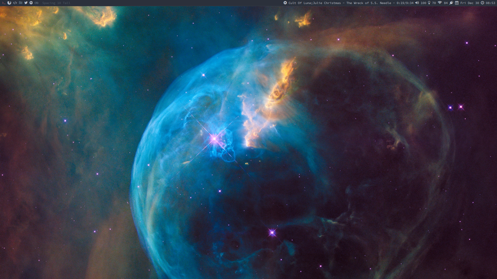
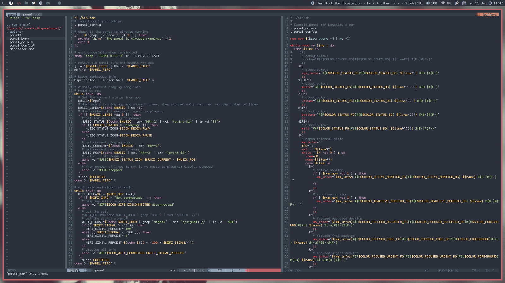
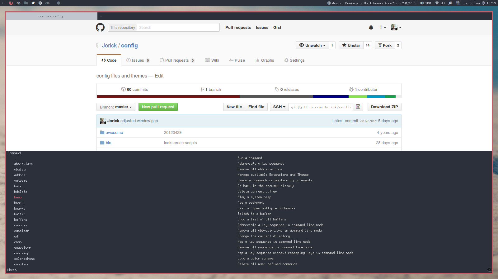
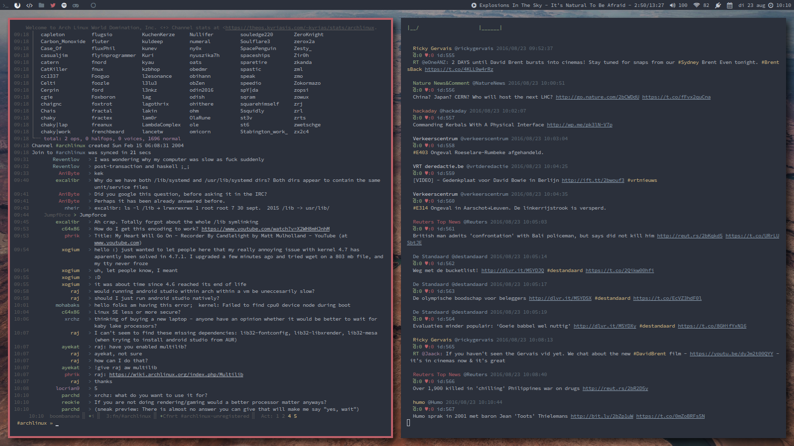

This repository contains the dotfiles and configuration files of my current setup. You can also find configuration for some of my older setups: awesome WM, dwm, subtle wm.

# Current setup:

* OS: [Arch Linux](http://www.archlinux.org)
* WM: [bspwm](https://github.com/baskerville/bspwm)
* Hotkey daemon: [sxhkd](https://github.com/baskerville/sxhkd)
* Panel: [lemonbar xft](https://github.com/krypt-n/bar)
* Shell: Zsh with [Pure prompt](https://github.com/sindresorhus/pure)
* Colorscheme: [base16 ocean dark](https://github.com/chriskempson/base16)
* Text editor: [neovim](https://github.com/neovim/neovim)
* Web browser: Firefox using stylish and vimperator extensions

## Screenshot

Clean:

Neovim in action

Firefox with stylish and vimperator

Irssi and [Rainbowstream](https://github.com/DTVD/rainbowstreaml)

